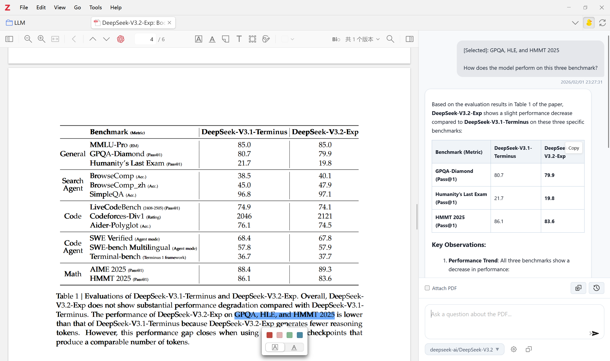
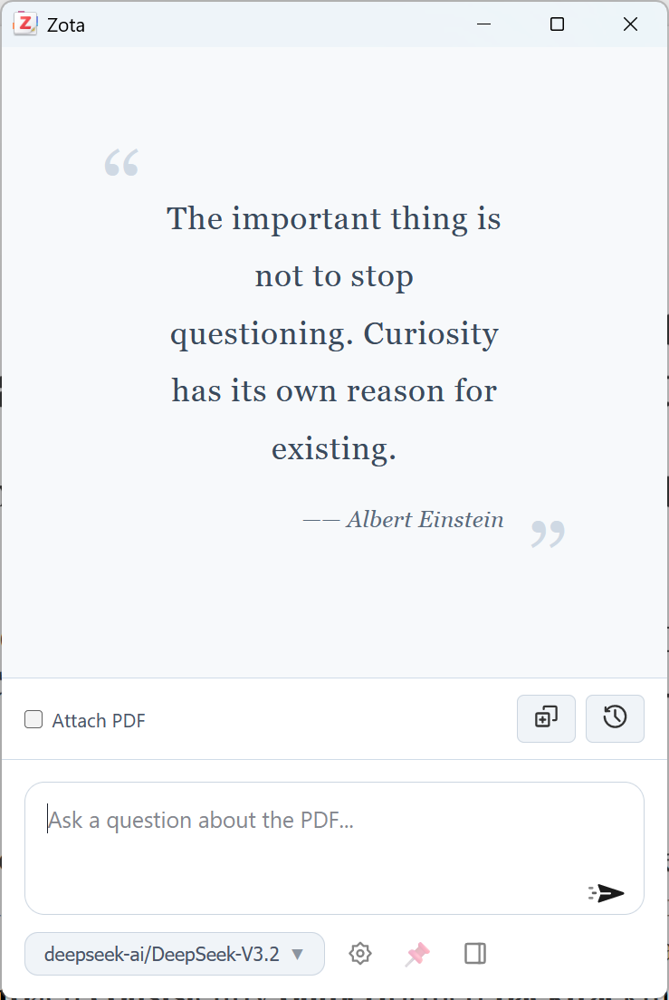

<h1> Zota</h1>

  

**Chat with AI about your PDF documents in Zotero.**

[English](README.md) | [简体中文](doc/README-zhCN.md)

## Screenshots

|             Sidebar Panel             |                 Float Window                 |
| :-------------------------------------------: | :-----------------------------------------------: |
|  |  |

## Features

- **No vendor lock-in**: Bring your own OpenAI-Compatible API endpoint
- **PDF Context**: Attach PDF content or select specific paragraphs for context-aware responses
- **Streaming**: Real-time response streaming
- **History**: Per-document conversation history
- **Markdown**: Full markdown with syntax rendering

## Installation
1. Download `.xpi` from [Releases](https://github.com/merc-hecl/zota/releases)
2. Zotero → `Tools` → `Add-ons` → ⚙️ → `Install Add-on From File...`

## Quick Start
1. Open a PDF in Zotero
2. Click the chat icon in toolbar
3. Check "Attach PDF" or select specific paragraphs to include document context 
4. Start chatting in the sidebar panel or float window

## Configuration
Go to `Settings` → `Zota` to:

- Set OpenAI-compatible API endpoint (e.g., https://api.openai.com/v1)
- Set API key and select model (e.g., gpt-4o)
- Adjust max tokens, temperature, max PDF content length, system prompt

## License

[AGPL-3.0](LICENSE)

## Acknowledgments

- [Zotero Plugin Template](https://github.com/windingwind/zotero-plugin-template) - This project used the Zotero Plugin Template.
- [paper-chat-for-zotero](https://github.com/syt2/paper-chat-for-zotero) - This project was forked from paper-chat-for-zotero
- [Kimi-K2.5](https://github.com/MoonshotAI/Kimi-K2.5) - This project was entirely developed using the Kimi-k2.5 model.
