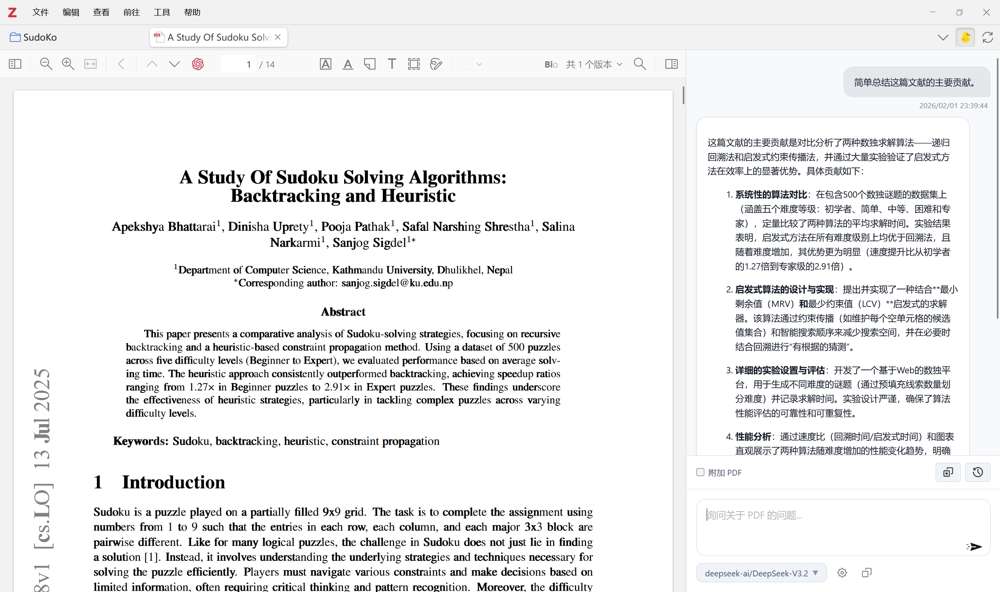
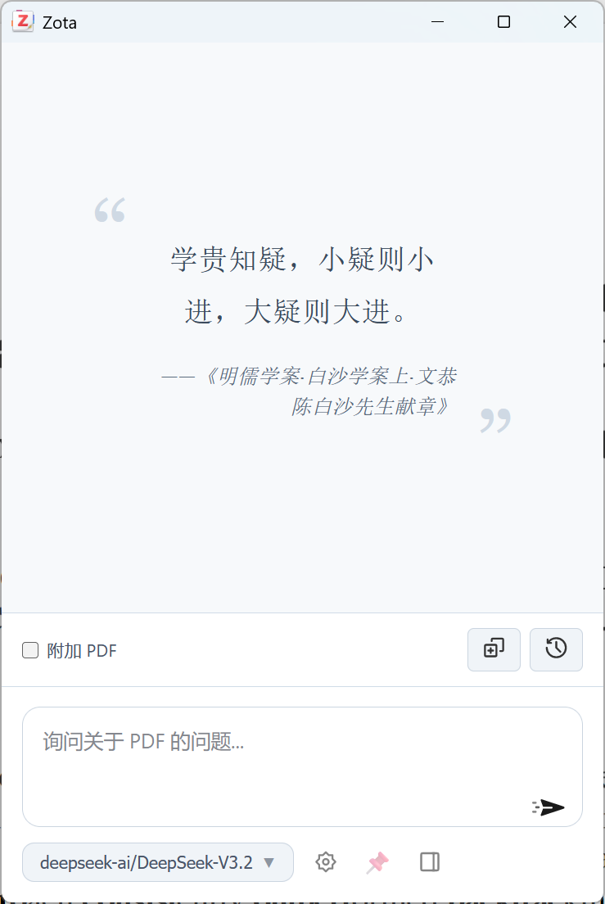

<h1> Zota</h1>

   

**在 Zotero 中直接与 AI 讨论 PDF 文档。**

[English](../README.md) | [简体中文](README-zhCN.md)

## 截图

|              边栏窗口               |                 浮动窗口                  |
| :---------------------------------------: | :---------------------------------------: |
|  |  |

## 特性

- **无供应商锁定**: 使用你自己的 OpenAI-Compatible API 端点
- **PDF 上下文**: 附加 PDF 内容或者划选段落获得上下文感知回复
- **流式输出**: 实时响应流
- **历史记录**: 每个文档独立的对话历史
- **Markdown**: 完整 Markdown 支持

## 安装

1. 从 [Releases](https://github.com/merc-hecl/zota/releases) 下载 `.xpi` 文件
2. Zotero → `工具` → `附加组件` → ⚙️ → `从文件安装附加组件...`

## 快速开始

1. 在 Zotero 中打开 PDF
2. 点击工具栏中的聊天图标
3. 勾选"附加 PDF"或选择特定段落以包含文档上下文
4. 开始在边栏面板或浮动窗口中聊天

## 配置

进入 `设置` → `Zota`：

- 设置 OpenAI-Compatible API 端点（例如 `https://api.openai.com/v1`）
- 输入 API Key 并选择模型
- 调整最大 Token 数、温度、最大上传 PDF 字符数、系统提示词

## 许可证

[AGPL-3.0](../LICENSE)

## 致谢

- [Zotero Plugin Template](https://github.com/windingwind/zotero-plugin-template) - 本项目使用了 Zotero Plugin Template。
- [paper-chat-for-zotero](https://github.com/syt2/paper-chat-for-zotero) - 本项目是 paper-chat-for-zotero 的一个分支。
- [Kimi-K2.5](https://github.com/MoonshotAI/Kimi-K2.5) - 本项目完全使用 Kimi-K2.5 模型进行开发。
